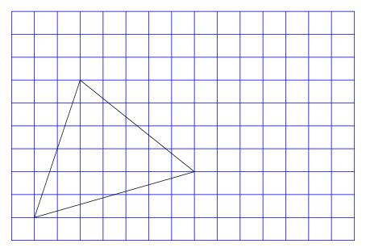
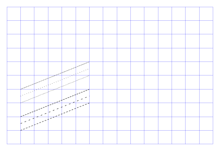
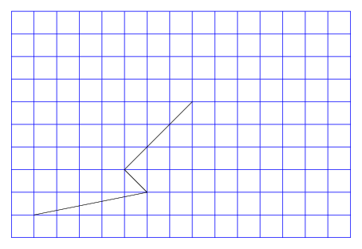
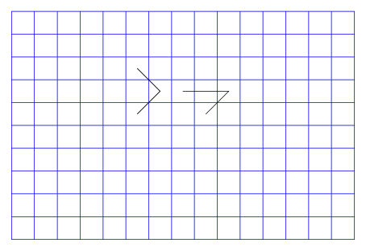
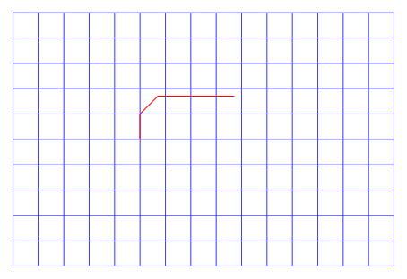

# 000 basis

The basis for our course is the following TikZ picture, that draws a blue grid from (0,0) in the left bottom corner to (15,10) the top right corner.

```latex
%!TEX TS-program = LuaLaTeX
\documentclass[tikz,border=0.5cm]{standalone}

\pdfvariable suppressoptionalinfo \numexpr32+64+512\relax

\begin{document}
\begin{tikzpicture}
\draw[step=1cm,blue,thin] (0,0) grid (15,10);
\end{tikzpicture}
\end{document}
 
```

# 001 simple_lines

Using the `\draw` command TikZ can draw a line from one coordinate to another. The width of the line can be specified explicitly, however TikZ provides a few default values as well.

```latex
%!TEX TS-program = LuaLaTeX
\documentclass[tikz,border=0.5cm]{standalone}

\pdfvariable suppressoptionalinfo \numexpr32+64+512\relax

\begin{document}
\begin{tikzpicture}
\draw[step=1cm,blue,thin] (0,0) grid (15,10);
\draw[ultra thin] (1,1) -- (3,2);
\draw[very thin] (1,1.5) -- (3,2.5);
\draw[thin] (1,2) -- (3,3);
\draw[semithick] (1,2.5) -- (3,3.5);
\draw[thick] (1,3) -- (3,4);
\draw[very thick] (1,3.5) -- (3,4.5);
\draw[ultra thick] (1,4) -- (3,5);
\draw[line width=4pt] (1,4.5) -- (3,5.5);
\draw (1,5.5) -- (3,6.5);

\end{tikzpicture}
\end{document}
```

# 002 simple_lines

One can also specify more than two coordinates for a line, as the following example shows.

```latex
%!TEX TS-program = LuaLaTeX
\documentclass[tikz,border=0.5cm]{standalone}

\pdfvariable suppressoptionalinfo \numexpr32+64+512\relax

\begin{document}
\begin{tikzpicture}
\draw[step=1cm,blue,thin] (0,0) grid (15,10);

\draw (1,1) -- (2,2) -- (3,1) -- (7,6);

\end{tikzpicture}
\end{document}
```

# 003 close path

A path can be closed automatically when instead of the first coordinate again the option `-- cycle` is set.

```latex
%!TEX TS-program = LuaLaTeX
\documentclass[tikz,border=0.5cm]{standalone}

\pdfvariable suppressoptionalinfo \numexpr32+64+512\relax

\begin{document}
\begin{tikzpicture}
\draw[step=1cm,blue,thin] (0,0) grid (15,10);

\draw (1,1) -- (3,7) -- (8,3) -- cycle;

\end{tikzpicture}
\end{document}
```

# 004 line styles

Besides solid lines TikZ supports also `dashed` and `dotted` lines. Each of them is also available in a `loosely` and `densely` version.

It is also possible to define more sophisticated `patterns`.

```latex
%!TEX TS-program = LuaLaTeX
\documentclass[tikz,border=0.5cm]{standalone}

\pdfvariable suppressoptionalinfo \numexpr32+64+512\relax

\begin{document}
\begin{tikzpicture}
\draw[step=1cm,blue,very thin] (0,0) grid (15,10);

\draw [dashed] (1,1) -- (6,3);
\draw [loosely dashed] (1,1.5) -- (6,3.5);
\draw [densely dashed] (1,2) -- (6,4);

\draw [dotted] (1,3) -- (6,5);
\draw [loosely dotted] (1,3.5) -- (6,5.5);
\draw [densely dotted] (1,4) -- (6,6);

\end{tikzpicture}
\end{document}
```

# 005 relative coordinates

You can also use relative coordinates by adding one or two plus signs before the coordinate.

The version with two plus signs updates the coordinate from which the relative steps are taken, so based on some point we say "move x units horizontally and y units vertically", the next relative coordinate uses the newly created coordinate to determine the next step.

```latex
%!TEX TS-program = LuaLaTeX
\documentclass[tikz,border=0.5cm]{standalone}

\pdfvariable suppressoptionalinfo \numexpr32+64+512\relax

\begin{document}
\begin{tikzpicture}
\draw[step=1cm,blue,thin] (0,0) grid (15,10);

\draw (1,1) -- ++(5,1) -- ++(-1,1) -- ++(3,3);
\end{tikzpicture}
\end{document}
 
```

# 006 relative coordinates no updates

The version with just one plus sign might be a little bit confusing at first.

Let us compare it with the two-plus-version. The two-plus version in the following picture starts with the point (5.5,5.5), from there we move one unit to the right and one unit up and from _this new point_ one unit to the left and one unit up.

The one-plus-version uses the point (8.5,5.5) as _reference base_ for *all* following one-plus-coordinates. We start from (8.5,5.5) one unit to the right and one unit up, the next coordinate is one unit to the left and one unit up from the original point (8.5,5.5).

```latex
%!TEX TS-program = LuaLaTeX
\documentclass[tikz,border=0.5cm]{standalone}

\pdfvariable suppressoptionalinfo \numexpr32+64+512\relax

\begin{document}
\begin{tikzpicture}
\draw[step=1cm,blue,thin] (0,0) grid (15,10);
\draw (5.5,5.5) -- ++(1,1) -- ++(-1,1);

\draw (8.5,5.5) -- +(1,1) -- +(-1,1);

\end{tikzpicture}
\end{document}
 
```

# 007 polar coordinates
```latex
%!TEX TS-program = LuaLaTeX
\documentclass[tikz,border=0.5cm]{standalone}

\pdfvariable suppressoptionalinfo \numexpr32+64+512\relax

\begin{document}
\begin{tikzpicture}
\draw[step=1cm,blue,thin] (0,0) grid (15,10);
\draw[red,thick] (5,5) -- ++(90:1) -- ++(45:1) -- ++(0:3) ;

\end{tikzpicture}
\end{document}
 
```

