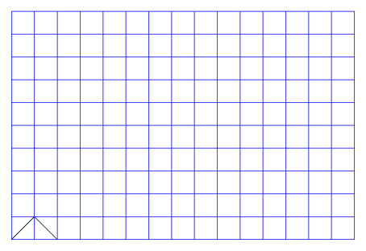

# 000-basis
```latex
\documentclass[tikz,border=0.5cm]{standalone}

\begin{document}
\begin{tikzpicture}
\draw[step=1cm,blue,thin] (0,0) grid (15,10);
\end{tikzpicture}
\end{document}
```

# 001-simple_lines

Using the `\draw` command TikZ can draw a line from one coordinate to another. The width of the line can be specified explicitly, however TikZ provides a few default values as well.

```latex
\documentclass[tikz,border=0.5cm]{standalone}

\begin{document}
\begin{tikzpicture}
\draw[step=1cm,blue,thin] (0,0) grid (15,10);
\draw[ultra thin] (1,1) -- (3,2);
\draw[very thin] (1,1.5) -- (3,2.5);
\draw[thin] (1,2) -- (3,3);
\draw[semithick] (1,2.5) -- (3,3.5);
\draw[thick] (1,3) -- (3,4);
\draw[very thick] (1,3.5) -- (3,4.5);
\draw[ultra thick] (1,4) -- (3,5);
\draw[line width=4pt] (1,4.5) -- (3,5.5);
\draw (1,5.5) -- (3,6.5);

\end{tikzpicture}
\end{document}
```

# 002-simple_lines

One can also specify more than two coordinates for a line, as the following example shows.

```latex
\documentclass[tikz,border=0.5cm]{standalone}

\begin{document}
\begin{tikzpicture}
\draw[step=1cm,blue,thin] (0,0) grid (15,10);

\draw (1,1) -- (2,2) -- (3,1) -- (7,6);

\end{tikzpicture}
\end{document}
```

